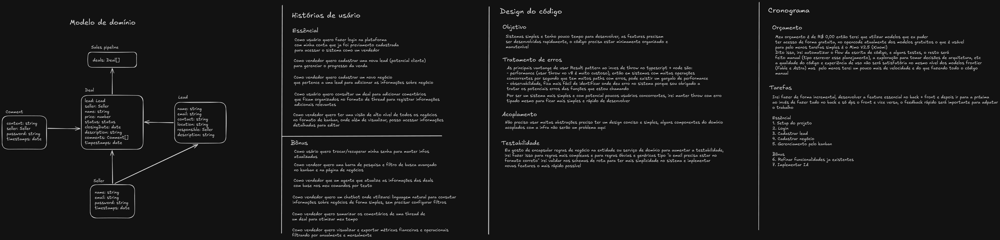

# Sales Pipeline

CRM simples para um time de vendas gerenciar leads e negócios. Um painel onde o vendedor vê seus negócios organizados por status e consegue criar leads, negociar, comentar e fechar vendas.

## Roadmap

### Essencial

- [x] Setup do projeto (monorepo, Docker, configs)
- [x] Login/Cadastro (Seller module)
- [x] Cadastrar lead
- [ ] Listar e filtrar lead
- [ ] Cadastrar negócio (Deal)
- [ ] Status do negócio (transição no funil, ganho/perdido)
- [ ] Comentários em lead/negócio
- [ ] Board (kanban)

### Bônus

- [ ] Refinar funcionalidades já existentes
- [ ] Implementar IA

## Stack Tecnológica

| Camada       | Tecnologias                                                          |
| ------------ | -------------------------------------------------------------------- |
| **Backend**  | Fastify 5, Drizzle ORM, PostgreSQL 16, Zod, JWT, bcrypt, Pino        |
| **Frontend** | React 19, Vite 8, Tailwind CSS 4, React Router 7                     |
| **Shared**   | Zod schemas (validação compartilhada entre back e front)             |
| **Infra**    | Docker, pnpm workspaces, Biome (lint/format), Vitest, Testcontainers |

## Rascunho Inicial



Antes de começar, escrevi meus pensamentos, incluindo:

- **Modelo de domínio**: entidades centrais (Seller, Lead, Deal, Comment) e seus relacionamentos
- **Histórias de usuário**: essenciais (login, cadastrar lead/negócio, kanban) e bônus (IA, chatbot, métricas)
- **Design do código**: objetivos, tratamento de erros, acoplamento e testabilidade
- **Cronograma**: orçamento baixo, decisões de IA, e ordem de implementação incremental

## Importante

No caminho, várias ideias mudaram com base em situações que eu não previ foram aparecendo — por exemplo, a modelagem e as histórias de usário, inicialmente fiz o rascunho serviu para enxergar da forma simples o que considerei mais intuitivo mas depois fui adaptando. As decisões finais, com contexto e trade-offs, estão nos [ADRs](docs/adr/README.md).

## Arquitetura

O projeto é um **monorepo** com 3 pacotes gerenciados por pnpm workspaces:

```
sales-pipeline/
├── shared/                       # @sales/shared
│   └── src/schemas/              # Schemas Zod + tipos usados por back e front
│
├── backend/                      # @sales/api
│   └── src/
│       ├── app.ts                # Factory do Fastify (plugins, rotas, swagger)
│       ├── config/               # envs, db, seed
│       ├── lib/                  # jwt, bcrypt, etc
│       ├── modules/
│       │   └── <entidade>/        # Um módulo autocontido
│       │       ├── <entidade>.ts            # Entidade
│       │       ├── <entidade>-repository.ts # Interface do repositório
│       │       ├── <entidade>-policies.ts   # Regras de negócio
│       │       ├── instances.ts            # DI manual
│       │       ├── routes/                 # Definição das rotas Fastify
│       │       ├── use-cases/              # Orquestração do fluxo
│       │       ├── services/               # Interfaces de serviços externos
│       │       └── persistence/            # Implementação Drizzle
│       └── utils/
│
├── frontend/                     # @sales/web
│   └── src/
│       ├── app.tsx               # Router
│       ├── components/           # Componentes de UI reutilizáveis
│       ├── hooks/                # Server state (React Query)
│       ├── lib/                  # API client, estilos
│       └── pages/                # Uma pasta por tela/fluxo
│
├── docs/adr/                     # Decisões de design (ADRs)
├── docker-compose.yml            # PostgreSQL 16
├── biome.jsonc                   # Lint e format
└── pnpm-workspace.yaml           # Config do monorepo
```
